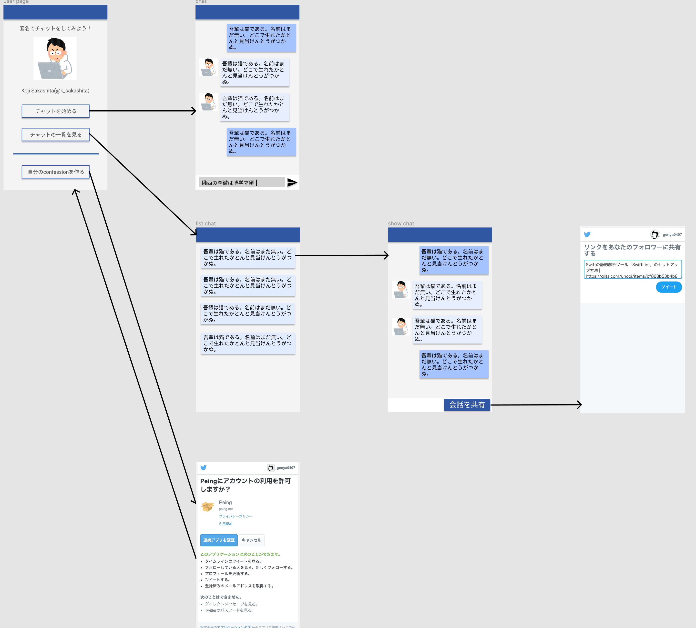
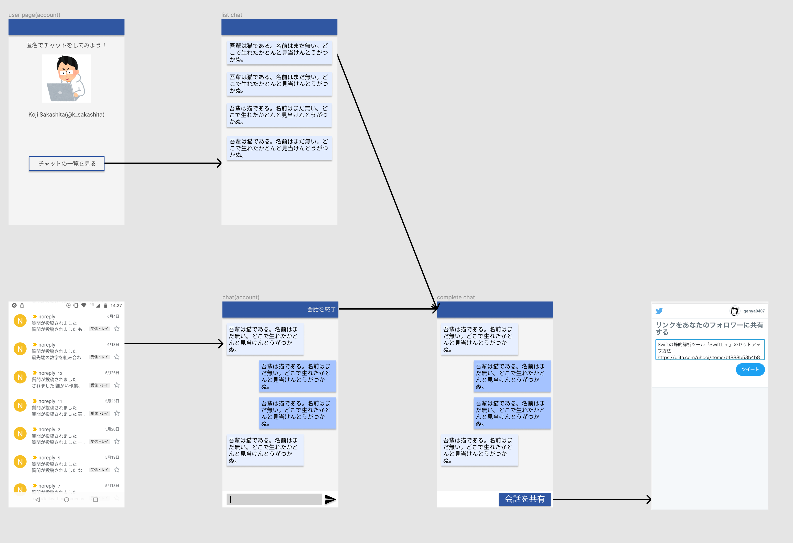

## Product title (製品名)

Confession

## Background information (背景情報)

- [質問箱](https://peing.net/ja/)は、匿名で質問ができるサービス
  - 質問された人が回答すると、Twitterに質問と回答がツイートされる
  - 1質問に対して1回答で1つのセッションが終わる
  - 質問を連投して来る人がたまにいる
    - 質問箱で会話をしたがる人がいる
- 自分が匿名の状態で特定の誰かと対話をしたいというニーズがある

## Product definition / core value (製品の目的とコアバリュー)

- Product definition:
  - Twitter上の人と匿名でチャットができる
    - "半匿名"
      - 「自分は匿名」で「相手は非匿名」という状態
      - 懺悔室(confession)と同じ構造
        - 懺悔室：信徒は匿名だが、神父は非匿名
    - 質問箱と違って、複数のテキストを一つのセッション上でやり取りできる
      - 対話的な質問が可能になる
- Core Value:
  - 嫌われるリスクなく人とコミュニケーションができる
    - 質問箱と同じ構造
  - やりとりに「セッション」をもたせることができる
    - 質問-回答という一対以上の長いやりとりができる

## User Types & Needs (ユーザー種類・ニーズ)

- SNSユーザー
- シャイ

## Story (製品・サービスを通してユーザーがどのような体験をするのかを、ストーリーとして描写する)

- 質問者
  - 機械学習エンジニアの[Koji Sakashita](https://twitter.com/k_sakashita)にあこがれていて、どうやったらKojiさんみたいに強くなれるか知りたい
  - Twitter上でリプライやDMで質問すると、言葉遣いや内容がKojiさんの気に障ったときにに嫌われたりブロックされたりするかもしれない
  - 幸いKojiさんはconfessionのアカウントを持っているので匿名で質問をすることができ、嫌われたりブロックされたりするリスクなしに質問することができる
  - confessionを使って質問をしてみよう
  - 「どうしたらKojiさんみたいに強くなれますか」というテキストからチャットを開始した
    - 自分：どうしたらKojiさんみたいに強くなれますか
    - Koji：「強い」とはどういう意味ですか？
    - 自分：機械学習エンジニアとして一人前という意味です
    - Koji：まずこのあたりの本を読みましょう 「（書籍名）」「（書籍名）」
    - 自分：すいません、自分そもそもプログラミング初心者なので、もう少し簡単な本から始めたいです...
    - Koji：自分がプログラミングを始めたときは「（書籍名）」という本を読んで勉強をはじめましたが、今だと「（書籍名）」とかがオススメですね
    - 自分：ありがとうございます、勉強してみます！
  - 機械学習・プログラミングのおすすめの本を教えてもらうことができた。これから頑張って勉強していこう。

- 回答者
  - confessionに「どうしたらKojiさんみたいに強くなれますか」という質問が来ていた。初心者のことは応援してあげたいが、「強い」という言葉の意味がよくわからない。「インターネットで強い言葉を使う」という意味かもしれないし、「優秀な機械学習エンジニアである」という意味かもしれない。とりあえず確かめてみよう
    - (上述のやりとりをする)
  - 初心者にアドバイスをすることができて嬉しい
  - 他にも同じ悩みを持っている初心者の人がいるかも知れないし、一連のやり取りをTwitterに投稿しておこう

## Wireframe of key flows (主な流れのワイヤーフレーム)

### 質問者側の画面遷移

### 回答者側の画面遷移

