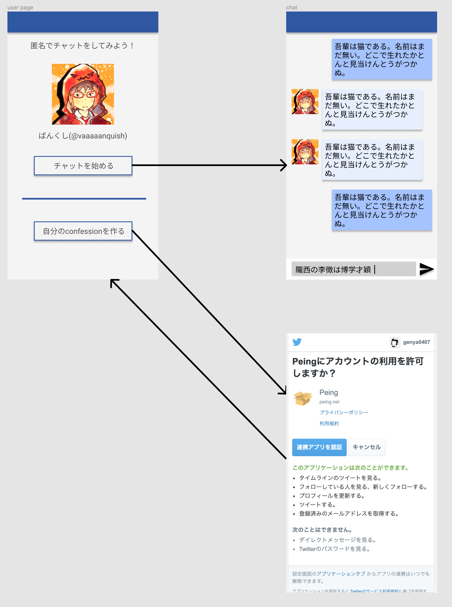

## Product title (製品名)

Confession

## Background information (背景情報)

- [質問箱](https://peing.net/ja/)は、匿名で質問ができるサービス
  - 質問された人が回答すると、Twitterに質問と回答がツイートされる
  - 1質問に対して1回答で1つのセッションが終わる
  - 質問を連投して来る人がたまにいる
    - 質問箱で会話をしたがる人がいる

## Product definition / core value (製品の目的とコアバリュー)

- Product definition:
  - Twitter上の人と匿名でチャットができる
    - "半匿名"
      - 「自分は匿名」で「相手は非匿名」という状態
      - 懺悔室と同じ構造
        - 信徒は匿名だが、神父は非匿名
    - 質問箱と違って、複数のテキストを一つのセッション上でやり取りできる
      - 対話的な質問が可能になる
- Core Value:
  - 嫌われるリスクなく人とコミュニケーションができる
    - 質問箱と同じ構造
  - やりとりに「セッション」をもたせることができる
    - 質問-回答という一対以上の長いやりとりができる

## User Types & Needs (ユーザー種類・ニーズ)

- SNSユーザー
- シャイ

## Story (製品・サービスを通してユーザーがどのような体験をするのかを、ストーリーとして描写する)

- 機械学習エンジニアの[ばんくし](https://twitter.com/vaaaaanquish)にあこがれていて、どうやったらばんくしさんみたいに強くなれるか知りたい
- Twitter上でリプライやDMで質問すると、言葉遣いや内容がばんくしさんの気に障ったときにに嫌われたりブロックされたりするかもしれない
- 幸いばんくしさんは質問箱とconfessionのアカウントを持っているので匿名で質問をすることができ、嫌われたりブロックされたりするリスクがない
- 「どうやったらばんくしさんみたいに強くなれるか」という質問は抽象的で、1質問1回答という少ないやり取りでは対話が完結しないかもしれない
- 質問箱ではなくconfessionを使って質問をしてみよう
- 「どうしたらばんくしさんみたいに強くなれますか」というテキストからチャットを開始した
  - 自分：どうしたらばんくしさんみたいに強くなれますか
  - ばんくし：「強い」とはどういう意味ですか？
  - 自分：機械学習エンジニアとして一人前という意味です
  - ばんくし：まずこのあたりの本を読みましょう 「（書籍名）」「（書籍名）」
  - 自分：すいません、自分そもそもプログラミング初心者なので、もう少し簡単な本から始めたいです...
  - ばんくし：自分がプログラミングを始めたときは「（書籍名）」という本を読んで勉強をはじめましたが、今だと「（書籍名）」とかがオススメですね
  - 自分：ありがとうございます、勉強してみます！
- 機械学習・プログラミングのおすすめの本を教えてもらうことができた

## Wireframe of key flows (主な流れのワイヤーフレーム)

