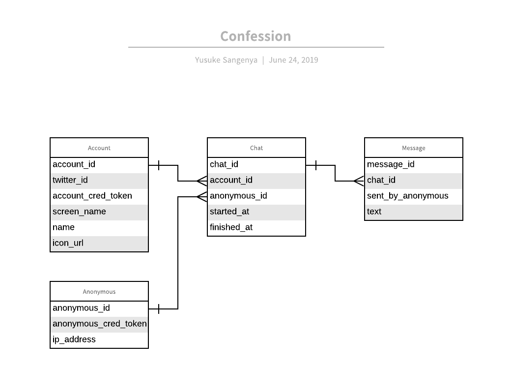

## Technical design 

### Overview

- Web application
  - Frontend: Vue.js
  - Backend: Go
  - Database: PostgreSQL
  - Communication method: WebSocket

### Domain Language

- Account
  - Chat開始の対象となれる人間(StoryのKoji Sakashita)
- Anonymous
  - AccountとChatをする人間(Storyの質問者)
- Chat
  - AccountとAnonymousの間でやりとりされるMessageのSequence
- Message
  - 文章

### ER図

### Backend Technologies

- net/http
- httprouter: https://github.com/julienschmidt/httprouter
- authorization
  - Authorization: Bearer <Token>
    - https://tools.ietf.org/html/rfc6750
    - https://qiita.com/uasi/items/cfb60588daa18c2ec6f5
- query builder
  - https://github.com/doug-martin/goqu
- migration
  - https://github.com/golang-migrate/migrate
- websocket
  - https://godoc.org/github.com/gorilla/websocket
- twitter login
  - https://github.com/dghubble/gologin

### Frontend Technologies

- localStorage
  - store authorization token
  - https://developer.mozilla.org/en-US/docs/Web/API/Window/localStorage
- websocket
  - https://developer.mozilla.org/en-US/docs/Web/API/WebSockets_API